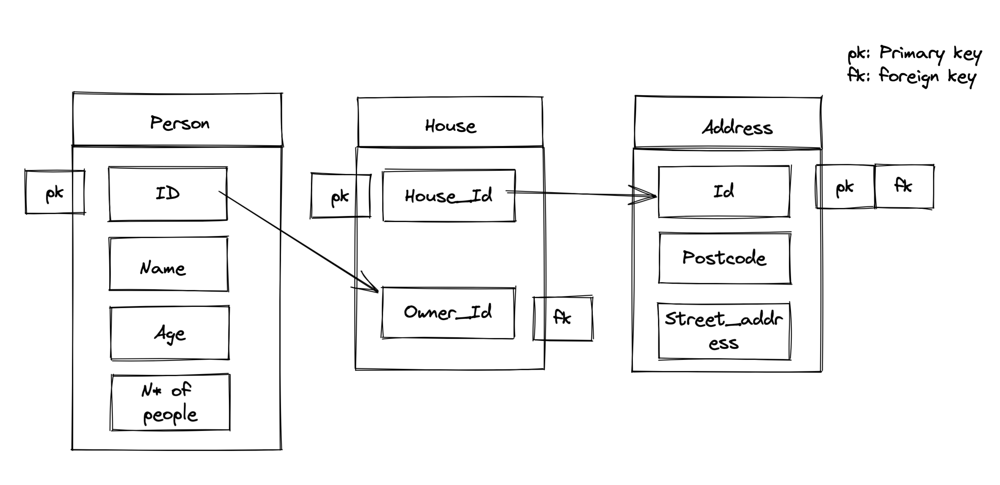

# Type of database implemented
*SQL*

# Schema

# Requests API will be capable of handling

- Store people, houses and addresses
	+ POST
	+ PATCH/PUT
	+ DELETE
	
- Look up a house, its address and owner
	+ GET
 
- Look up people in our neighborhood within certain age brackets and with specific household sizes
	+ GET + PARAMS for SQL QUERY

# API Routes and Req Res content

## Store people, houses and addresses
/{people/houses/addresses}/new -> POST
- Request: {person/house/address} CSV data 
	+ ID, Name, Age, NPpl
	  3, Mark, 35, 4
- Response: 201
 

/{people/houses/addresses}/:id -> PATCH
- Request: :id plus field to update and new value in {key: value} format
- Response: 202
 
/{people/houses/addresses}/:id -> DELETE
- Request: id
- Response 200

## Look up a house, its address and owner
/{houses/addresses/owner}/ -> GET
- Request: endpoint
- Response: CSV data relative to endpoint request 

/{houses/addresses/owner}/:id -> GET
- Request: endpoint with id
- Response: CSV data relative to endpoint request
 
## Look up people in our neighborhood within certain age brackets and with specific household sizes
/people/:params -> GET then QUERY
- Request: endpoint and parameters
- Response: CSV data relative to endpoint request, filtered by given parameters in a SQL query
 

